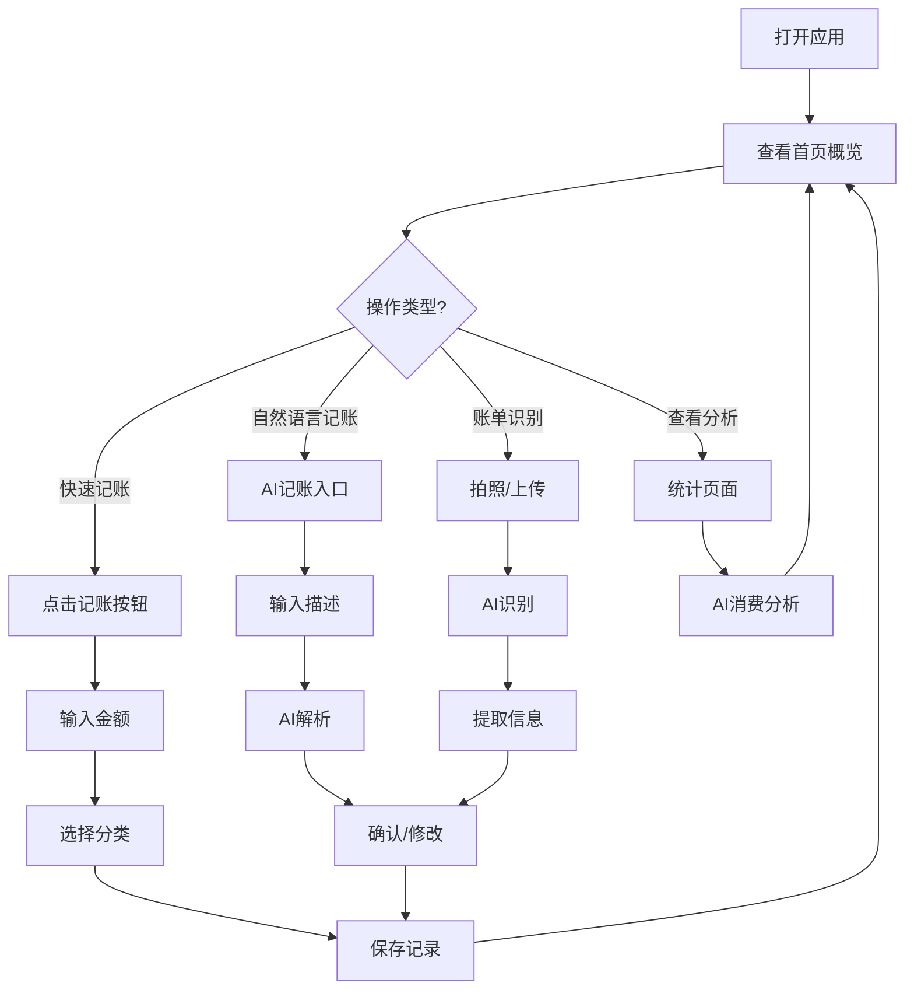

## 1. 产品概述

蜜蜂记账是一款面向大学生群体的轻量化智能记账工具，集成 DeepSeek AI 大模型，提供智能账单识别、自然语言记账、消费分析和预算建议等功能，帮助大学生管理生活费、追踪琐碎支出、养成良好的消费习惯。以蜜蜂为主题，象征勤劳积累，帮助用户实现财务自由的第一步。

## 2. 核心功能

### 2.1 用户角色
| 角色 | 注册方式 | 核心权限 |
|------|----------|----------|
| 普通用户 | 无需注册，本地使用 | 所有记账、统计、预算、AI智能功能 |

### 2.2 功能模块
1. **首页**: 今日概览、快速记账入口、最近交易记录、预算进度、AI智能助手入口
2. **记账页**: 手动记账表单、语音输入、分类选择、自然语言记账
3. **统计页**: 支出概览、分类饼图、趋势折线图、AI消费分析
4. **预算页**: 月度预算设置、分类预算、进度展示、AI预算建议
5. **AI助手页**: 智能对话、消费建议、账单识别
6. **我的页**: 数据导出、CSV导入、提醒设置、主题切换、API配置

### 2.3 页面详情
| 页面名称 | 模块名称 | 功能描述 |
|----------|----------|----------|
| 首页 | 今日概览 | 显示今日支出/收入金额、本月累计 |
| 首页 | 快速记账 | 悬浮按钮，一键进入记账页面 |
| 首页 | 最近交易 | 最近5-10条交易记录列表 |
| 首页 | 预算进度 | 本月预算使用进度条 |
| 首页 | AI助手入口 | 快速进入AI助手页面 |
| 记账页 | 金额输入 | 数字键盘，支持小数点 |
| 记账页 | 分类选择 | 7个预设分类+自定义标签 |
| 记账页 | 语音输入 | Web Speech API语音识别 |
| 记账页 | 备注输入 | 文本输入框 |
| 记账页 | 自然语言记账 | 输入"今天午饭花了25"自动解析记账 |
| 统计页 | 支出概览 | 本月总支出/收入/结余 |
| 统计页 | 分类饼图 | Chart.js饼图展示各分类占比 |
| 统计页 | 趋势折线图 | 近7天/30天支出趋势 |
| 统计页 | AI消费分析 | DeepSeek分析消费习惯，给出建议 |
| 预算页 | 总预算设置 | 月度总预算金额设置 |
| 预算页 | 分类预算 | 各分类预算限额设置 |
| 预算页 | 进度展示 | 各分类预算使用进度 |
| 预算页 | AI预算建议 | 根据历史数据智能推荐预算 |
| AI助手页 | 智能对话 | 与AI对话咨询财务问题 |
| AI助手页 | 账单识别 | 拍照/上传账单图片，AI解析记账 |
| AI助手页 | 消费报告 | 生成个性化消费分析报告 |
| 我的页 | 数据导出 | 导出JSON格式数据备份 |
| 我的页 | CSV导入 | 导入微信/支付宝账单 |
| 我的页 | 提醒设置 | 每周/每月记账提醒 |
| 我的页 | 主题切换 | 深色/浅色模式 |
| 我的页 | API配置 | 配置DeepSeek API Key |

## 3. AI智能功能详解

### 3.1 自然语言记账
用户输入自然语言描述，AI自动解析为结构化记账数据：
- 输入示例："今天午饭花了25块"、"昨天打车花了15元去学校"、"收到兼职工资800"
- AI解析：金额、分类、类型(收入/支出)、日期、备注

### 3.2 智能消费分析
基于用户历史数据，AI生成个性化分析报告：
- 消费习惯分析：识别高频消费场景和时段
- 异常消费预警：检测异常高额支出
- 节省建议：针对可优化支出给出建议
- 同类用户对比：与同消费水平用户对比分析

### 3.3 AI预算建议
根据历史消费数据，智能推荐预算设置：
- 总预算建议：基于收入和必要支出计算
- 分类预算建议：根据历史分类占比分配
- 超支预警：预测本月可能超支的分类

### 3.4 账单图片识别
用户上传账单/小票图片，AI提取关键信息：
- 支持格式：拍照、相册图片
- 提取信息：商户名称、金额、日期、商品明细
- 自动分类：根据商户类型智能匹配分类

## 4. 核心流程

### 4.1 智能记账流程
用户打开应用 → 点击记账 → 选择"自然语言记账" → 输入描述 → AI解析 → 确认/修改 → 保存

### 4.2 流程图

## 5. 用户界面设计

### 5.1 设计风格
- **主色调**: 黄色(#FFD700)、黑色(#000000)、白色(#FFFFFF)
- **辅助色**: 橙色(#FFA500)、绿色(#32CD32)
- **AI特色色**: 渐变紫蓝色(#667eea → #764ba2)，用于AI功能标识
- **按钮风格**: 圆角按钮，黄色主按钮带轻微阴影
- **字体**: 标题使用粗体，正文使用常规字重
- **布局风格**: 底部导航栏，卡片式内容展示
- **图标风格**: Lucide React线性图标，蜜蜂主题装饰元素

### 5.2 页面设计概览
| 页面名称 | 模块名称 | UI元素 |
|----------|----------|--------|
| 首页 | 今日概览 | 黄色渐变背景卡片，大字金额显示 |
| 首页 | 快速记账 | 黄色圆形悬浮按钮，蜜蜂图标 |
| 首页 | 交易列表 | 白色卡片列表，分类图标+金额+时间 |
| 首页 | AI入口 | 渐变紫蓝色按钮，Sparkles图标 |
| 记账页 | 金额输入 | 大号数字显示，自定义数字键盘 |
| 记账页 | 分类选择 | 横向滚动分类图标，选中高亮 |
| 记账页 | 自然语言输入 | 带AI标识的输入框，实时解析预览 |
| AI助手页 | 对话界面 | 类似聊天界面，AI消息带渐变背景 |
| AI助手页 | 账单上传 | 拖拽/点击上传区域，支持预览 |
| 统计页 | 饼图 | Chart.js饼图，黄色系配色 |
| 统计页 | AI分析卡片 | 渐变背景卡片，显示AI洞察 |
| 预算页 | 进度条 | 黄色进度条，橙色预警，红色超支 |
| 预算页 | AI建议 | 智能推荐卡片，一键应用 |

### 5.3 响应式设计
- 移动端优先设计，适配375px-428px宽度
- 支持触摸操作，按钮最小点击区域44px
- 底部导航栏固定，方便单手操作

### 5.4 动画效果
- 页面切换: 滑动过渡动画
- 数字变化: 数字滚动动画
- 按钮点击: 缩放反馈
- 列表项: 淡入动画
- AI响应: 打字机效果
