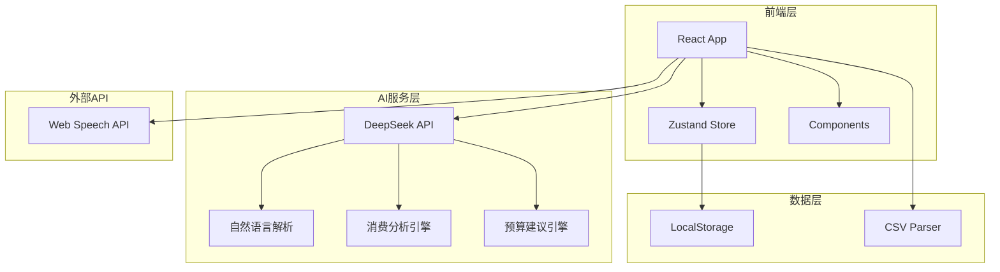
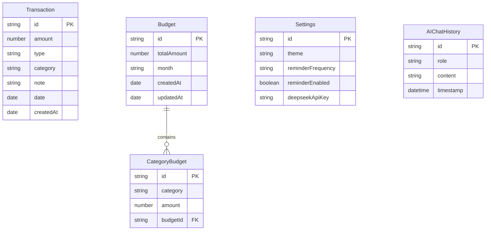

## 1. 架构设计



## 2. 技术说明

- **前端框架**: React 18 + TypeScript
- **构建工具**: Vite
- **样式方案**: Tailwind CSS 3
- **状态管理**: Zustand
- **路由管理**: React Router DOM 6
- **图表库**: Chart.js + react-chartjs-2
- **图标库**: Lucide React
- **数据存储**: LocalStorage
- **语音识别**: Web Speech API
- **AI服务**: DeepSeek API

## 3. 路由定义

| 路由 | 页面 | 描述 |
|------|------|------|
| `/` | 首页 | 今日概览、快速记账入口、最近交易 |
| `/add` | 记账页 | 手动记账、语音输入、自然语言记账 |
| `/stats` | 统计页 | 支出统计、图表展示、AI消费分析 |
| `/budget` | 预算页 | 预算设置与管理、AI预算建议 |
| `/ai-assistant` | AI助手页 | 智能对话、账单识别、消费报告 |
| `/profile` | 我的页 | 设置、数据管理、API配置 |

## 4. AI服务集成

### 4.1 DeepSeek API 封装

```typescript
interface DeepSeekConfig {
  apiKey: string;
  baseURL: string;
  model: string;
}

interface ChatMessage {
  role: 'system' | 'user' | 'assistant';
  content: string;
}

interface AIResponse {
  content: string;
  usage: {
    prompt_tokens: number;
    completion_tokens: number;
  };
}
```

### 4.2 AI功能模块

| 功能模块 | 输入 | 输出 | Prompt策略 |
|----------|------|------|------------|
| 自然语言记账 | 用户描述文本 | 结构化记账数据 | 结构化JSON输出prompt |
| 消费分析 | 历史交易数据 | 分析报告文本 | 数据分析prompt模板 |
| 预算建议 | 历史数据+当前预算 | 预算建议JSON | 财务规划prompt |
| 账单识别 | 图片描述/OCR文本 | 结构化账单数据 | 信息提取prompt |
| 智能对话 | 用户问题 | 回答文本 | 财务助手角色prompt |

### 4.3 Prompt模板设计

**自然语言记账Prompt:**
```
你是一个记账助手。请解析用户的记账描述，提取以下信息并以JSON格式返回：
- amount: 金额（数字）
- type: 类型（income/expense）
- category: 分类
- note: 备注
- date: 日期（YYYY-MM-DD格式）

分类列表：餐饮、交通、购物、娱乐、学习、日用、其他

用户输入：{userInput}
```

**消费分析Prompt:**
```
你是一个财务顾问。请根据用户的消费数据，提供个性化的消费分析和建议。
分析维度：
1. 消费习惯总结
2. 主要支出类别分析
3. 异常消费识别
4. 节省建议

用户数据：{transactionData}
```

## 5. 项目结构

```
src/
├── components/          # 通用组件
│   ├── Layout/          # 布局组件
│   ├── Navigation/      # 底部导航
│   ├── TransactionItem/ # 交易记录项
│   ├── NumberKeyboard/  # 数字键盘
│   ├── AIChatBubble/    # AI对话气泡
│   └── LoadingDots/     # 加载动画
├── pages/               # 页面组件
│   ├── Home/            # 首页
│   ├── AddRecord/       # 记账页
│   ├── Stats/           # 统计页
│   ├── Budget/          # 预算页
│   ├── AIAssistant/     # AI助手页
│   └── Profile/         # 我的页
├── services/            # API服务
│   ├── deepseek.ts      # DeepSeek API封装
│   ├── aiParser.ts      # AI解析服务
│   └── prompts.ts       # Prompt模板
├── store/               # Zustand状态管理
│   ├── transactionStore.ts  # 交易记录
│   ├── budgetStore.ts       # 预算管理
│   ├── settingsStore.ts     # 应用设置
│   └── aiStore.ts           # AI状态
├── hooks/               # 自定义Hooks
│   ├── useSpeech.ts     # 语音识别
│   ├── useLocalStorage.ts # 本地存储
│   └── useAI.ts         # AI服务Hook
├── utils/               # 工具函数
│   ├── csvParser.ts     # CSV解析
│   ├── exportData.ts    # 数据导出
│   └── formatters.ts    # 格式化函数
├── types/               # TypeScript类型
│   └── index.ts
├── App.tsx              # 根组件
└── main.tsx             # 入口文件
```

## 6. 数据模型

### 6.1 数据模型定义



### 6.2 TypeScript 类型定义

```typescript
interface Transaction {
  id: string;
  amount: number;
  type: 'income' | 'expense';
  category: string;
  note?: string;
  date: string;
  createdAt: string;
}

interface Budget {
  id: string;
  totalAmount: number;
  month: string;
  categoryBudgets: CategoryBudget[];
  createdAt: string;
  updatedAt: string;
}

interface CategoryBudget {
  id: string;
  category: string;
  amount: number;
}

interface Settings {
  theme: 'light' | 'dark';
  reminderEnabled: boolean;
  reminderFrequency: 'weekly' | 'monthly';
  deepseekApiKey?: string;
}

interface ChatMessage {
  id: string;
  role: 'user' | 'assistant';
  content: string;
  timestamp: string;
}

interface ParsedTransaction {
  amount: number;
  type: 'income' | 'expense';
  category: string;
  note: string;
  date: string;
  confidence: number;
}

type Category = {
  id: string;
  name: string;
  icon: string;
  type: 'income' | 'expense';
};
```

## 7. 预设分类

| 分类ID | 名称 | 图标 | 类型 |
|--------|------|------|------|
| food | 餐饮 | Utensils | expense |
| transport | 交通 | Car | expense |
| shopping | 购物 | ShoppingBag | expense |
| entertainment | 娱乐 | Gamepad2 | expense |
| study | 学习 | Book | expense |
| daily | 日用 | Home | expense |
| other | 其他 | MoreHorizontal | expense |
| salary | 工资 | Wallet | income |
| parttime | 兼职 | Briefcase | income |
| allowance | 生活费 | Gift | income |
| bonus | 奖金 | Award | income |
| other_income | 其他收入 | PlusCircle | income |

## 8. 安全考虑

### 8.1 API Key 存储
- API Key 存储在 LocalStorage，仅本地使用
- 不在任何网络请求中暴露给第三方
- 用户可随时清除或更换 API Key

### 8.2 数据隐私
- 所有交易数据仅存储在用户本地
- AI请求仅发送必要的分析数据，不发送个人身份信息
- 用户可选择关闭AI功能
